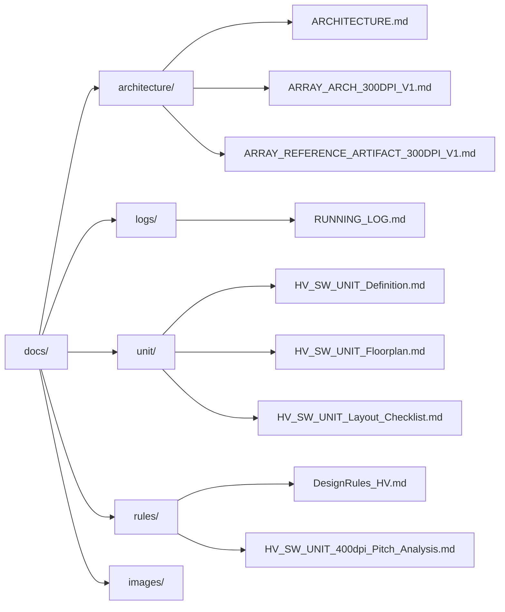

# Documentation – gf180-inkjet-driver

This directory contains **layout- and GDS-oriented design notes**
for the **GF180-based inkjet printhead driver IC exploration**.

The documents focus on **architecture definition**, **high-voltage device usage**,
and **layout-driven mixed-signal design**, with the explicit goal of
supporting **manual GDS generation** using the GF180MCU open PDK.

These materials function as **design rationale and layout justification**.
In addition to documenting viable structures, they explicitly record
**architectural limits identified through GDS-level exploration**,
rather than serving as a complete IC specification.

---

## 🔗 Links

| Language | GitHub Pages 🌐 | GitHub 💻 |
|----------|----------------|-----------|
| 🇺🇸 English |  |  |

---

## gf180-inkjet-driver Documentation

This documentation is organized by **design phase and intent**.

- architecture/: frozen physical architectures
- logs/: execution records (single source of truth)
- unit/: HV_SW_UNIT design materials
- rules/: process and layout constraints
- images/: GDS screenshots and visual evidence

---
## 📒 Execution & Visual Logs

These links provide the **ground truth record** of what was actually
executed and observed at the GDS level.

- **RUNNING LOG (Single Source of Truth)**  
  👉 [docs/logs/30_runs/RUNNING_LOG.md](https://github.com/Samizo-AITL/gf180-inkjet-driver/blob/main/docs/logs/30_runs/RUNNING_LOG.md)  
  Records every Run, decision, observation, and conclusion in chronological order.

- **GDS Screenshot Index**  
  👉 [docs/images/index.md](https://github.com/Samizo-AITL/gf180-inkjet-driver/blob/main/docs/images/index.html)  
  Complete visual index of all KLayout screenshots (PNG) corresponding to each Run and layout milestone.

---

## 🗺 Layout Map (GDS-Oriented Overview)

> 📌 **Mermaid rendering note**  
> This diagram is written in Mermaid syntax and is rendered correctly on GitHub.  
> GitHub Pages does not render Mermaid diagrams by default.
>
> 👉 Please view the rendered diagram on GitHub:  
[View on GitHub (docs/index.md)](https://github.com/Samizo-AITL/gf180-inkjet-driver/blob/main/docs/index.md)

---

## Representative GDS Artifact

The following image shows a **representative HV switch unit GDS**
generated during this exploration.

It demonstrates:
- DNWELL enclosure
- Continuous P+ guard ring
- Central HV device structure
- Explicit D / G / S / B pin exposure

This GDS serves as a **visual anchor**
for the unit- and array-level documents listed below.

---

## Array Layout Evolution (400 dpi Study)

The following snapshots document the **stepwise evolution**
of the HV_SW_UNIT array toward **400 dpi pitch (63.5 µm)**.
Each image corresponds to a concrete layout decision
and captures the moment where a design assumption
was either validated or rejected.

### Independent Unit Isolation (Baseline)

- DNWELL and guard ring are isolated per HV_SW_UNIT
- Guard ring outer boundary dominates pitch
- **400 dpi is clearly infeasible**

---

### Column-wise Guard Ring Sharing

- Guard ring redundancy reduced at array level
- Pitch pressure partially relieved
- Unit-level guard ring remnants still interfere

---

### Guard-Ring-Clean Shared Array (Final Check)

- Unit-level guard rings completely removed
- Guard ring no longer the dominant limiter
- **DNWELL enclosure and spacing become decisive**

---

## Document Index (GDS-Oriented)

Each document in this directory is written with a **clear downstream GDS target**
in mind. Conceptual discussion is intentionally limited to what directly
influences layout decisions.

### Architecture (Frozen)

- docs/architecture/ARCHITECTURE.md
- docs/architecture/ARRAY_ARCH_300DPI_V1.md
- docs/architecture/ARRAY_REFERENCE_ARTIFACT_300DPI_V1.md

### Unit-Level Design Materials

- docs/unit/HV_SW_UNIT_Definition.md
- docs/unit/HV_SW_UNIT_Floorplan.md
- docs/unit/HV_SW_UNIT_LW_Proposal.md
- docs/unit/HV_SW_UNIT_Layout_Checklist.md
- docs/unit/HV_SW_UNIT_IV_Expectations.md
- docs/unit/hv-devices.md

### Rules and Constraints

- docs/rules/DesignRules_HV.md
- docs/rules/HV_SW_UNIT_400dpi_Pitch_Analysis.md

---

## Design Philosophy

This documentation prioritizes:

- **Layout-first decision making**
- GDS-level understanding over schematic or RTL completeness
- Minimal structures that can be **directly translated into layout**
- Explicit recording of **why certain approaches fail**

The intent is not to demonstrate a finished inkjet driver IC,
but to preserve **design reasoning grounded in physical layout reality**.

---

## Status

- ✅ Automated digital flow feasibility evaluation completed
- ✅ Manual HV device and unit layout completed
- ✅ HV_SW_UNIT array and guard ring sharing studies completed
- ❌ 400 dpi (63.5 µm) array feasibility: **structurally infeasible under GF180 DNWELL assumptions**

---

## Rationale for NMOS-Based 4×2 Array Layout Check

Prior to fixing the 300 dpi configuration as the baseline array,
a **4×2 NMOS-based HV switch array** was intentionally selected
as the minimum verification structure for layout feasibility.

This choice was made for the following reasons:

- **Worst-case isolation constraints first**  
  Under GF180MCU rules, **DNWELL enclosure, spacing, and guard-ring continuity**
  dominate array pitch feasibility.
  A low-side **NMOS-centered topology** represents the most demanding case
  in terms of substrate noise isolation and DNWELL usage.
  Verifying pitch feasibility under this condition establishes
  a conservative physical baseline.

- **Avoidance of edge-dominated artifacts**  
  Single-unit or linear (1×N) layouts are strongly affected by
  guard-ring termination and DNWELL boundary effects.
  A **4×2 array** provides a central region that closely approximates
  an infinite array, allowing realistic evaluation of
  shared guard rings, well continuity, and routing congestion.

- **Array-level sharing and repetition check**  
  The 4×2 structure is the smallest block that simultaneously exposes:
  guard-ring sharing effectiveness, DNWELL shape propagation,
  power/ground rail continuity, and repeatability under tiling.

For these reasons, the **NMOS-based 4×2 array** was used as the
layout feasibility checkpoint.
Once a **300 dpi pitch** was confirmed under this worst-case condition,
the resulting configuration was promoted to the
**baseline (golden) array** for subsequent exploration.

---

## ✅ 300 dpi Array Implementation (Final Outcome)

Based on the GDS-level exploration documented above, a **300 dpi pitch
(~85.0 µm)** configuration was selected as the **minimum viable and
structurally consistent solution** under GF180MCU HV and DNWELL rules.

### Implemented Artifact

- **Generator**
  - `layout/hv_nmos_gr/klayout/hv_sw_unit_array_gr_shared_300dpi.py`
- **Generated GDS**
  - `layout/hv_nmos_gr/gds/hv_sw_unit_array_gr_shared_300dpi.gds`
- **Pitch**
  - 85.0 µm (300 dpi, margin included)
- **Guard Ring Strategy**
  - Column-wise shared P+ guard ring
  - Unit-level guard rings removed
- **Status**
  - ✅ GDS successfully generated and verified in KLayout

### Conclusion

While 400 dpi (63.5 µm) configurations fail due to unavoidable
DNWELL enclosure and spacing constraints, the **300 dpi array
represents a physically realizable layout point** for GF180-based
inkjet driver exploration.

This configuration is treated as the **baseline (golden) array**
for any subsequent device sizing, electrical evaluation,
or architectural extension.

---

## Disclaimer

This documentation is provided **for educational and exploratory purposes only**.

No guarantees are made regarding manufacturability, electrical performance,
reliability, or suitability for any commercial application.

