# 🖼 GDS Screenshot Index

This page lists **all screenshot PNGs** generated during the  
**GF180 HV layout and GDS-oriented exploration**.

Each image corresponds to a **concrete GDS artifact** and a  
**documented Run or structural milestone**.

This index exists purely to make **visual inspection fast and unambiguous**.

---

## 🧰 Environment

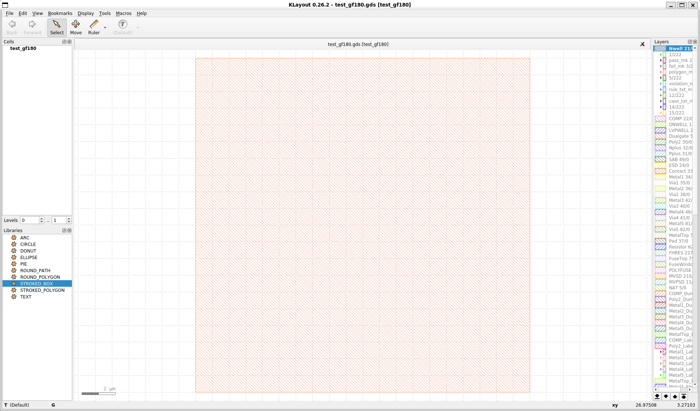

- 🖥 KLayout environment used for all manual and macro-based layout work

---

## 🧱 HV_SW_UNIT – Single / Array (Baseline)

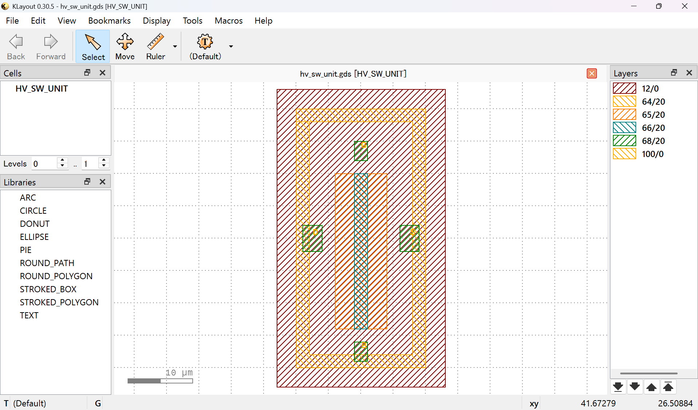

- ⚡ Single **HV_SW_UNIT** with DNWELL and guard ring

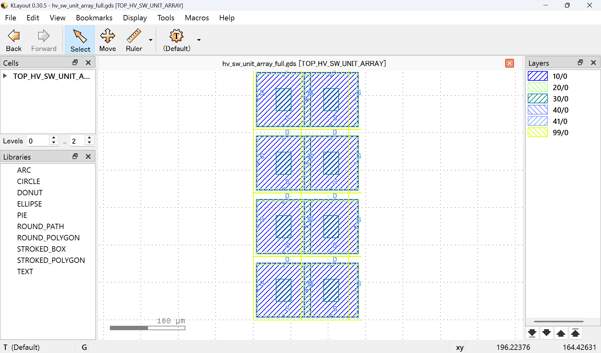

- 🧩 Naive array with per-unit DNWELL and guard ring  
- ❌ Pitch dominated by guard ring enclosure

---

## 🔁 Guard Ring Sharing Study

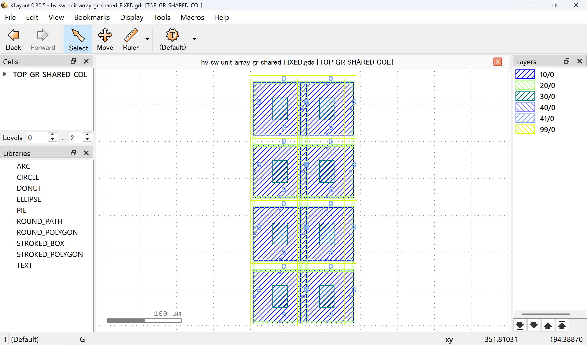

- 🧪 Column-wise guard ring sharing (intermediate state)

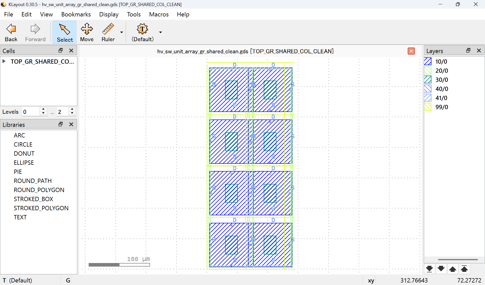

- 🧹 Guard-ring-clean shared configuration  
- 📏 Guard ring no longer dominant pitch limiter

---

## 🟡 300 dpi Array (Golden Baseline)

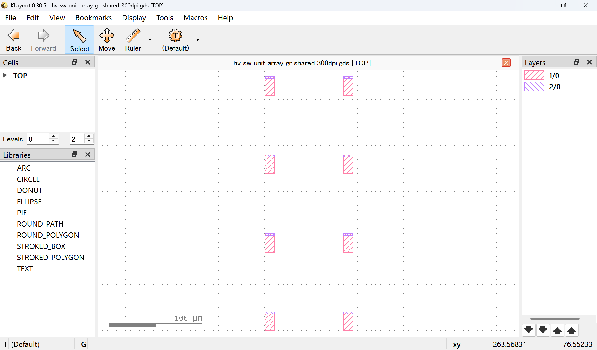

- 📐 300 dpi (~85 µm pitch) array  
- ✅ Structurally feasible under GF180 DNWELL constraints  
- ⭐ Treated as **golden baseline**

---

## 🧪 Run 001 – Probe Layout

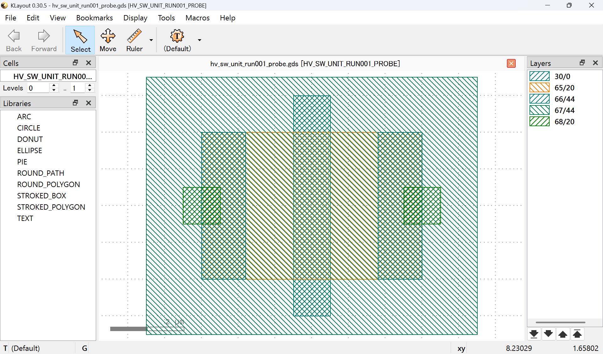

- 🔍 Aggressive probe layout to expose dominant HV constraints

---

## 🧪 Run 002 – Guard Strategy Change

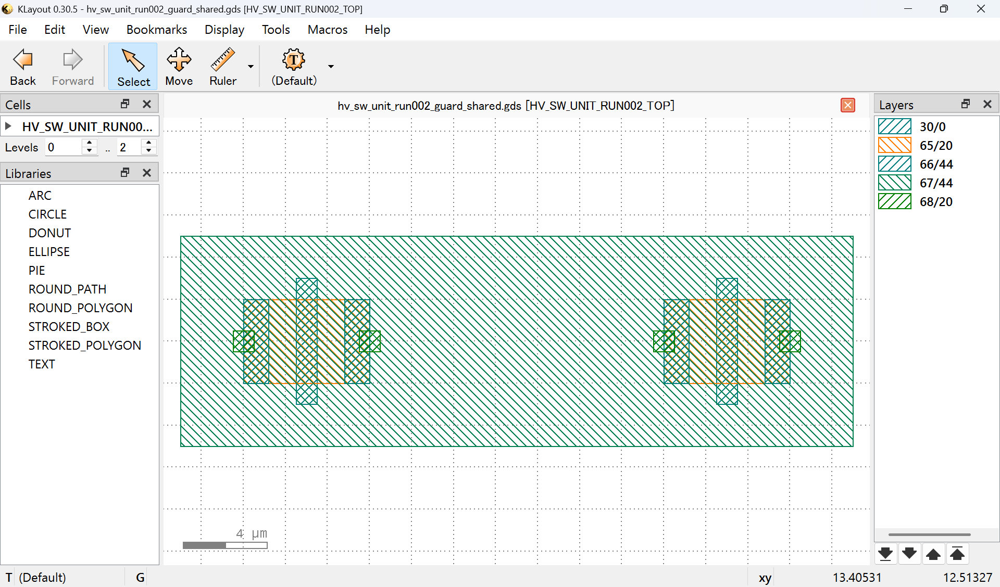

- 🔁 Per-cell guard ring → shared outer guard ring

---

## 🧪 Run 003 – Poly Gate Trim

- ✂ Poly gate end isolation study  
- 📉 Guard ring no longer pitch-dominant

---

## 🧪 Run 004 – X-Direction Tiling Evaluation

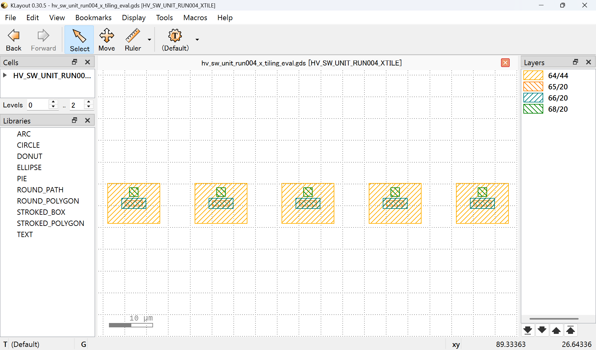

- 🧭 X-tiling evaluation based on **Run 003**

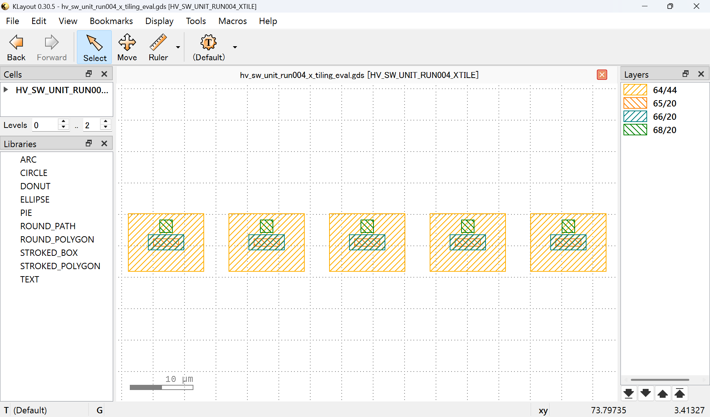

- 📏 **16 µm pitch** confirmed geometrically feasible (marginal)

---

## 🧪 Run 005 – Metal1 Stub Trim (Pitch Sweep)

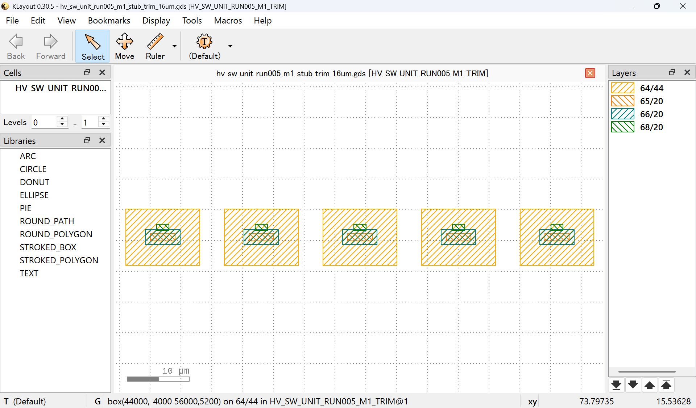

- 🧲 Metal1 stub trim, **16 µm pitch**

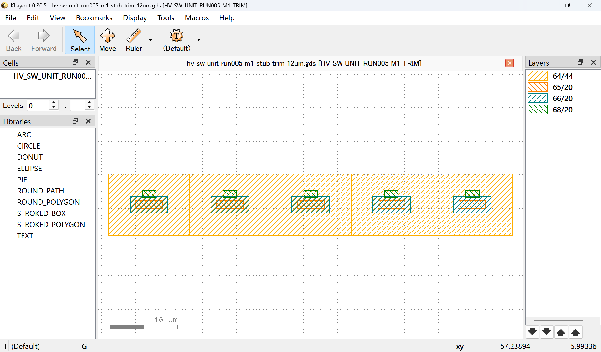

- ❗ Metal1 stub trim, **12 µm pitch**

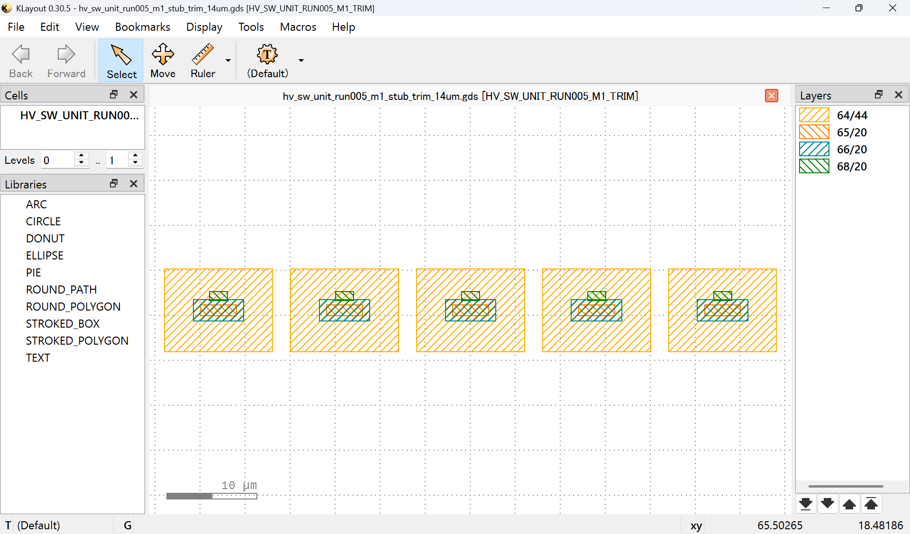

- ⚠ Metal1 stub trim, **14 µm pitch**

---

## HV Inverter 1ch Unit (300dpi)

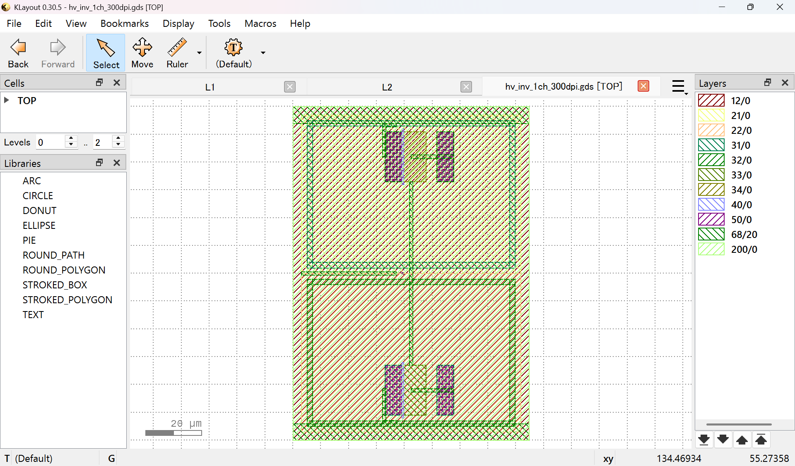

---

## 📝 Notes

- 🖼 All images are **direct screenshots from KLayout**
- 🚫 No DRC / LVS deck was applied (layout-first exploration)
- 🔗 Image order matches **RUNNING_LOG** progression
- 👁 This index is **purely visual** and contains no design intent beyond what is logged

---

**End of document.**
