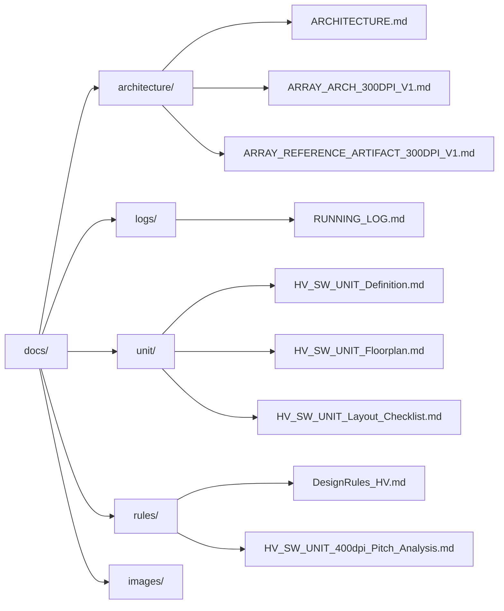

# 📘 Documentation – gf180-inkjet-driver

This directory contains **layout- and GDS-oriented design notes** for the  
**GF180-based inkjet printhead driver IC exploration**.

These documents focus on:

- 🧱 **Architecture definition**
- ⚡ **High-voltage device usage**
- 🧭 **Layout-driven mixed-signal design**

with the explicit goal of supporting **manual GDS generation** using the  
**GF180MCU Open PDK**.

Rather than serving as a complete IC specification, these materials function as:

- 📐 **Design rationale**
- 🧾 **Layout justification**
- 🧪 **Recorded architectural limits discovered at the GDS level**

Both *successful structures* and *explicitly failed approaches* are preserved,
grounded in **what was physically drawable and verifiable in GDS**.

---

## 🔗 Links

| Language | GitHub Pages 🌐 | GitHub 💻 |
|----------|----------------|-----------|
| 🇺🇸 English |  |  |

---

## 🗂 Documentation Structure

This documentation is organized by **design phase and intent**:

- **architecture/** : frozen physical architectures
- **logs/** : execution records (*single source of truth*)
- **unit/** : HV_SW_UNIT design materials
- **rules/** : process and layout constraints
- **images/** : GDS screenshots and visual evidence

---

## 📒 Execution & Visual Logs (Ground Truth)

These links provide the **authoritative record** of what was actually
*executed, observed, and concluded* at the GDS level.

- 🧾 **RUNNING LOG — Single Source of Truth**  
  👉 [docs/logs/30_runs/RUNNING_LOG.md](https://github.com/Samizo-AITL/gf180-inkjet-driver/blob/main/docs/logs/30_runs/RUNNING_LOG.md)

- 🖼 **GDS Screenshot Index**  
  👉 [docs/images/](https://github.com/Samizo-AITL/gf180-inkjet-driver/blob/main/docs/images/)

---

## 🗺 Layout Map (GDS-Oriented Overview)

> 📌 **Mermaid Rendering Note**  
> This diagram is written in Mermaid syntax and renders correctly on GitHub.  
> GitHub Pages does not render Mermaid diagrams by default.
>
> 👉 View the rendered diagram on GitHub:  
> https://github.com/Samizo-AITL/gf180-inkjet-driver/blob/main/docs/index.md

---

## 🧱 Representative GDS Artifact

The image below shows a **representative HV switch unit GDS** generated during
this exploration.

It demonstrates:

- 🟩 DNWELL enclosure  
- 🔁 Continuous P+ guard ring  
- ⚡ Central HV device structure  
- 📍 Explicit D / G / S / B pin exposure  

---

## 🧩 Array Layout Evolution — 400 dpi Study

The following snapshots document the **stepwise evolution** of the HV_SW_UNIT
array toward **400 dpi pitch (63.5 µm)**.

Each image captures a concrete layout decision and marks the point where a
design assumption was **validated or rejected** at the GDS level.

---

### 🔹 Independent Unit Isolation (Baseline)

- DNWELL and guard ring isolated per unit  
- Guard ring outer boundary dominates pitch  
- ❌ **400 dpi clearly infeasible**

---

### 🔹 Column-wise Guard Ring Sharing

- Guard ring redundancy reduced  
- Partial pitch relief achieved  
- Unit-level remnants still interfere  

---

### 🔹 Guard-Ring-Clean Shared Array (Final Check)

- Unit-level guard rings fully removed  
- Guard ring no longer dominant  
- ❌ DNWELL enclosure & spacing become decisive limiters  

---

## 📚 Document Index (GDS-Oriented)

All documents are written with a **clear downstream GDS target**.

### 🧱 Architecture (Frozen)

- docs/architecture/ARCHITECTURE.md  
- docs/architecture/ARRAY_ARCH_300DPI_V1.md  
- docs/architecture/ARRAY_REFERENCE_ARTIFACT_300DPI_V1.md  

### ⚡ Unit-Level Design

- docs/unit/HV_SW_UNIT_Definition.md  
- docs/unit/HV_SW_UNIT_Floorplan.md  
- docs/unit/HV_SW_UNIT_LW_Proposal.md  
- docs/unit/HV_SW_UNIT_Layout_Checklist.md  
- docs/unit/HV_SW_UNIT_IV_Expectations.md  
- docs/unit/hv-devices.md  

### 📏 Rules & Constraints

- docs/rules/DesignRules_HV.md  
- docs/rules/HV_SW_UNIT_400dpi_Pitch_Analysis.md  

---

## 🧠 Design Philosophy

This documentation prioritizes:

- 🧱 **Layout-first decision making**  
- 🔬 GDS-level understanding over schematic or RTL completeness  
- ✂ Minimal structures directly translatable into layout  
- 📝 Explicit recording of **why certain approaches fail**  

The goal is not a finished inkjet driver IC, but the preservation of  
**design reasoning grounded in physical layout reality**.

---

## 📊 Status

- ✅ Automated digital flow feasibility evaluated  
- ✅ Manual HV device & unit layout completed  
- ✅ Array & guard-ring sharing studies completed  
- ❌ 400 dpi (63.5 µm) feasibility: **structurally infeasible under GF180 DNWELL rules**

---

## 🧪 Why a 4×2 NMOS-Based Array Was Chosen

Before fixing 300 dpi as the baseline, a **4×2 NMOS-based HV switch array**
was selected as the **minimum feasibility checkpoint**.

Reasons:

- ⚠ **Worst-case isolation first**  
- 🎯 **Avoid edge-dominated artifacts**  
- 🔁 **Array-level repetition & sharing check**

Once **300 dpi** was confirmed under this worst-case condition,
it was promoted to the **baseline (golden) array**.

---

## ✅ 300 dpi Array — Final Outcome

A **300 dpi pitch (~85.0 µm)** was selected as the **minimum viable and
structurally consistent solution** under GF180MCU rules.

### Implemented Artifact

- 🛠 Generator  
  `layout/hv_nmos_gr/klayout/hv_sw_unit_array_gr_shared_300dpi.py`

- 📦 Generated GDS  
  `layout/hv_nmos_gr/gds/hv_sw_unit_array_gr_shared_300dpi.gds`

- 📏 Pitch  
  85.0 µm (300 dpi, margin included)

- 🔁 Guard Ring Strategy  
  Column-wise shared P+ guard ring, unit-level removed

- ✅ Status  
  Verified in KLayout

---

## ⚠ Disclaimer

This documentation is provided **for educational and exploratory purposes only**.

No guarantees are made regarding manufacturability, electrical performance,
reliability, or suitability for any commercial application.
