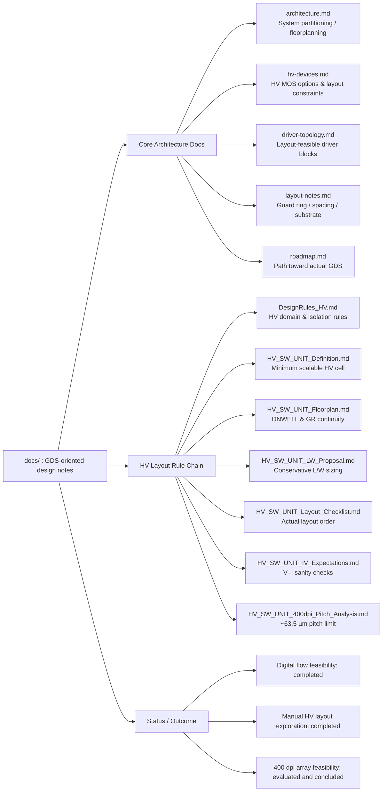

# Documentation – gf180-inkjet-driver

This directory contains **layout- and GDS-oriented design notes**
for the **GF180-based inkjet printhead driver IC exploration**.

The documents focus on **architecture definition**, **high-voltage device usage**,
and **layout-driven mixed-signal design**, with the explicit goal of
supporting **manual GDS generation** using the GF180MCU open PDK.

These materials function as **design rationale and layout justification**.
In addition to documenting viable structures, they explicitly record
**architectural limits identified through GDS-level exploration**,
rather than serving as a complete IC specification.

---

## 🔗 Links

| Language | GitHub Pages 🌐 | GitHub 💻 |
|----------|----------------|-----------|
| 🇺🇸 English |  |  |

---

## 🗺 Layout Map (GDS-Oriented Overview)

---

## Representative GDS Artifact

The following image shows a **representative HV switch unit GDS**
generated during this exploration.

It demonstrates:
- DNWELL enclosure
- Continuous P+ guard ring
- Central HV device structure
- Explicit D / G / S / B pin exposure

This GDS serves as a **visual anchor**
for the unit- and array-level documents listed below.

---

## Document Index (GDS-Oriented)

Each document in this directory is written with a **clear downstream GDS target**
in mind. Conceptual discussion is intentionally limited to what directly
influences layout decisions.

### Core Architecture Documents

- **architecture.md**  
  System-level partitioning and block definition for
  **manual layout boundaries**, with emphasis on:
  - High-voltage domain separation
  - Logic vs HV interaction points
  - Floorplanning implications for mixed-signal ICs

- **hv-devices.md**  
  High-voltage MOS devices available in GF180MCU and their
  layout-related constraints.
  This document directly supports:
  - **Single-device GDS cell generation**
  - Guard ring and substrate isolation experiments
  - Device-level spacing and topology comparison

- **driver-topology.md**  
  Minimal inkjet driver stage concepts focused on
  **layout feasibility rather than schematic completeness**.

- **layout-notes.md**  
  Practical layout observations derived from GF180MCU rules and
  mixed-signal constraints, including:
  - Guard ring placement and continuity
  - Substrate noise awareness and mitigation

- **roadmap.md**  
  A stepwise exploration plan documenting the transition from
  architectural concepts to **actual GDS artifacts**.

---

## High-Voltage Layout Rule Set (Inkjet-Focused)

The following documents define a **complete, layout-first rule chain**
for high-voltage MOS usage in inkjet driver ICs.
They are intended to be read **in order**.

- **DesignRules_HV.md**  
  HV domain separation, device classes, DNWELL and guard ring policy

- **HV_SW_UNIT_Definition.md**  
  Definition of the minimum scalable HV switch unit

- **HV_SW_UNIT_Floorplan.md**  
  DNWELL enclosure and guard ring continuity rules

- **HV_SW_UNIT_LW_Proposal.md**  
  Conservative channel length and width assumptions

- **HV_SW_UNIT_Layout_Checklist.md**  
  Practical checklist for manual HV layout execution

- **HV_SW_UNIT_IV_Expectations.md**  
  Pre-SPICE V–I (Id–Vd / Id–Vg) sanity expectations

- **HV_SW_UNIT_400dpi_Pitch_Analysis.md**  
  Feasibility study for **400 dpi nozzle pitch (~63.5 µm)**

Together, these documents capture both
**feasible layout structures** and
**architectural limits identified at the GDS level**.

---

## Design Philosophy

This documentation prioritizes:

- **Layout-first decision making**
- GDS-level understanding over schematic or RTL completeness
- Minimal structures that can be **directly translated into layout**
- Explicit recording of **why certain approaches fail**

The intent is not to demonstrate a finished inkjet driver IC,
but to preserve **design reasoning grounded in physical layout reality**.

---

## Status

- ✅ Automated digital flow feasibility evaluation completed
- ✅ Manual HV device and unit layout completed
- ✅ HV_SW_UNIT array and guard ring sharing studies completed
- ❌ 400 dpi (63.5 µm) array feasibility: **structurally infeasible under GF180 DNWELL assumptions**

---

## Disclaimer

This documentation is provided **for educational and exploratory purposes only**.

No guarantees are made regarding manufacturability, electrical performance,
reliability, or suitability for any commercial application.

---

## Layout Design Environment

---

## Outcome

This repository documents a **complete layout-driven exploration loop**:

- Single HV MOS device  
- → HV switch unit  
- → Array construction  
- → Guard ring sharing  
- → **Architectural feasibility conclusion**

The recorded artifacts ensure that
future work does not repeat the same infeasible design path.
